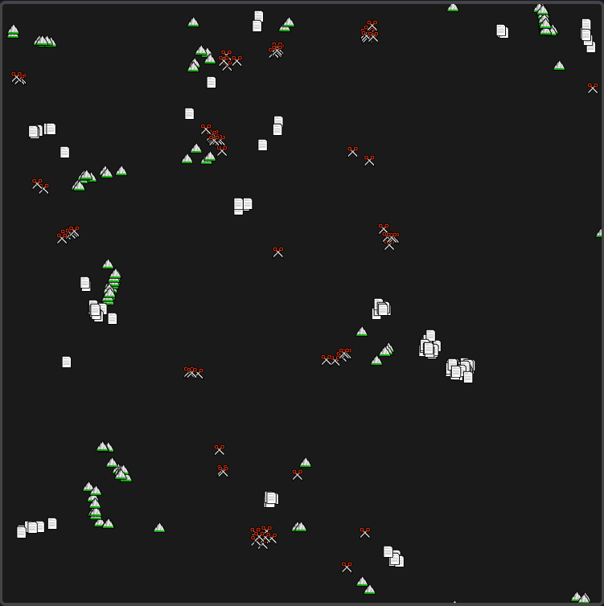
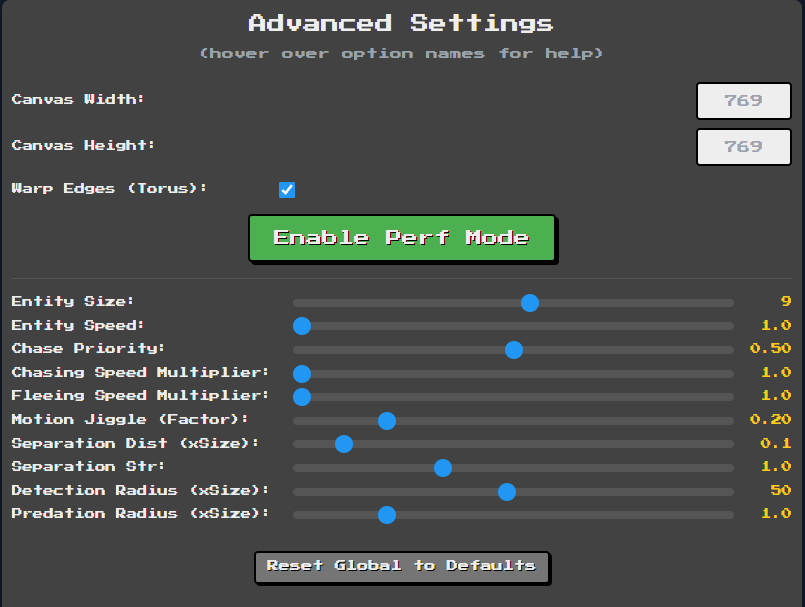

# Rock-Paper-Scissor Simulator

[](https://github.com/FistOfHit/Rock-Paper-Scissor-simulator/actions/workflows/deploy.yml)
[](https://github.com/FistOfHit/Rock-Paper-Scissor-simulator/actions/workflows/lint.yml)
[](https://github.com/FistOfHit/Rock-Paper-Scissor-simulator/actions/workflows/test.yml)

A 2D entity-based Rock-Paper-Scissor simulator done entirely by vibe-coding. Using Gemini 2.5 and Manus.

**[Play the game now!](https://fistofhit.github.io/Rock-Paper-Scissor-simulator/)**

## Introduction

In this game, rocks, papers, and scissors move around the canvas following realistic physics-inspired behaviors. Entities chase, flee, and even convert each other based on the traditional rules of Rock-Paper-Scissor. With both global and type-specific settings, you have control over the simulation's parameters to create unique gameplay experiences!

## Features

- **Interactive Simulation:** Watch as entities move, interact, and battle on canvas.
- **Advanced Settings:** Tweak parameters like entity size, speed, and detection radius.
- **Optimized Mode:** Enable a faster algorithm for smoother gameplay with many entities.
- **Statistics & Export:** View real-time stats and export simulation data as CSV or JSON.
- **Responsive Layout:** Adjusts canvas size based on browser window.

## How to Play

1. **Visit the [Live Demo](https://fistofhit.github.io/Rock-Paper-Scissor-simulator/)** or follow the local setup instructions below.
2. **Setup Counts:** Enter the desired number of rocks, papers, and scissors.
3. **Start Simulation:** Click the **Start** button and enjoy the simulation!
4. **View Stats:** Click the **Show Stats** button to display detailed statistics.
5. **Advanced Controls:** Use the **Advanced** button to open more settings and customize the game's behavior.
6. **Export Results:** Once the simulation ends or as it runs, click the **Export Results** button to download your simulation data.

## Local Development

### Prerequisites

- A modern web browser
- Git (optional, for cloning)

### Setup

1. **Clone the Repository:**
   ```bash
   git clone https://github.com/FistOfHit/Rock-Paper-Scissor-simulator.git
   cd Rock-Paper-Scissor-simulator
   ```
   
   Or download the ZIP file and extract it.

2. **Open in Browser:** Simply open the `index.html` file in your preferred web browser.

### Testing

The project uses Jest for testing. To run tests locally:

1. Install dependencies:
   ```bash
   npm install
   ```

2. Run tests:
   ```bash
   npm test
   ```

### Linting and Formatting

The project uses ESLint and Prettier for code quality and formatting:

```bash
# Run linting
npm run lint

# Run formatting
npm run format
```

## Screenshots

<p align="center">
  
  
</p>

## Technologies Used

- **JavaScript:** Simulation logic, entity interactions, and event handling.
- **HTML5 Canvas:** Rendering of game entities and animations.
- **CSS & TailwindCSS:** Styling and responsive design.
- **Google Fonts:** Using *Press Start 2P* for a retro game feel.
- **Jest:** JavaScript testing framework.
- **ESLint & Prettier:** Code quality and formatting.
- **GitHub Actions:** CI/CD workflows for testing, linting, and deployment.

## Project Structure

```
├── .github/workflows/   # CI/CD workflows
├── __tests__/           # Jest test files
├── images/              # Screenshots and images
├── .eslintrc.json       # ESLint configuration
├── .prettierrc.json     # Prettier configuration
├── jest.config.js       # Jest configuration
├── jest.setup.js        # Jest setup file
├── *.js                 # JavaScript source files
├── index.html           # Main HTML file
├── styles.css           # CSS styles
└── README.md            # This file
```

## Contributing

Contributions are welcome! Please feel free to submit a Pull Request.

1. Fork the repository
2. Create your feature branch (`git checkout -b feature/amazing-feature`)
3. Commit your changes (`git commit -m 'Add some amazing feature'`)
4. Push to the branch (`git push origin feature/amazing-feature`)
5. Open a Pull Request

## License

This project is licensed under the MIT License – see the [LICENSE](LICENSE) file for details.

## Acknowledgements

Thank you for checking out the Rock-Paper-Scissor-simulator. Enjoy the game and feel free to contribute or customize it further!

Happy simulating!
